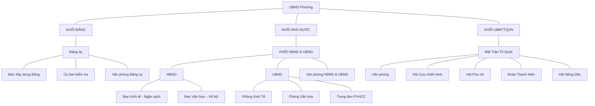
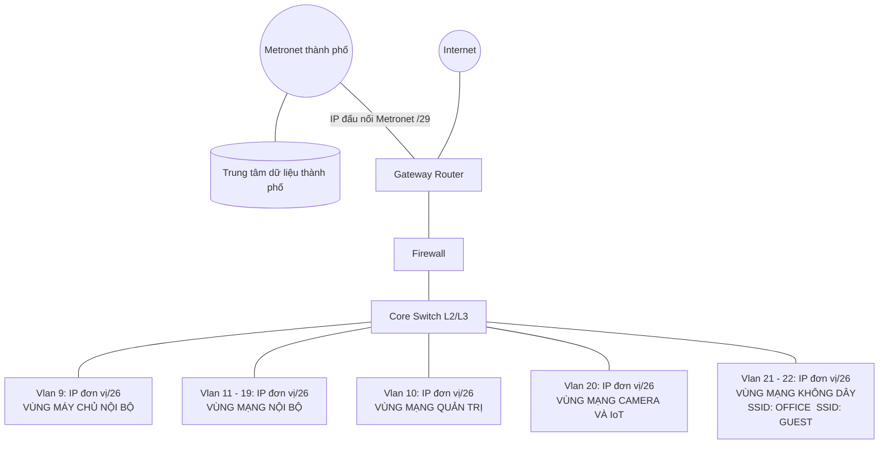
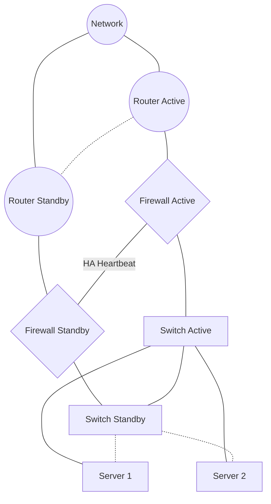
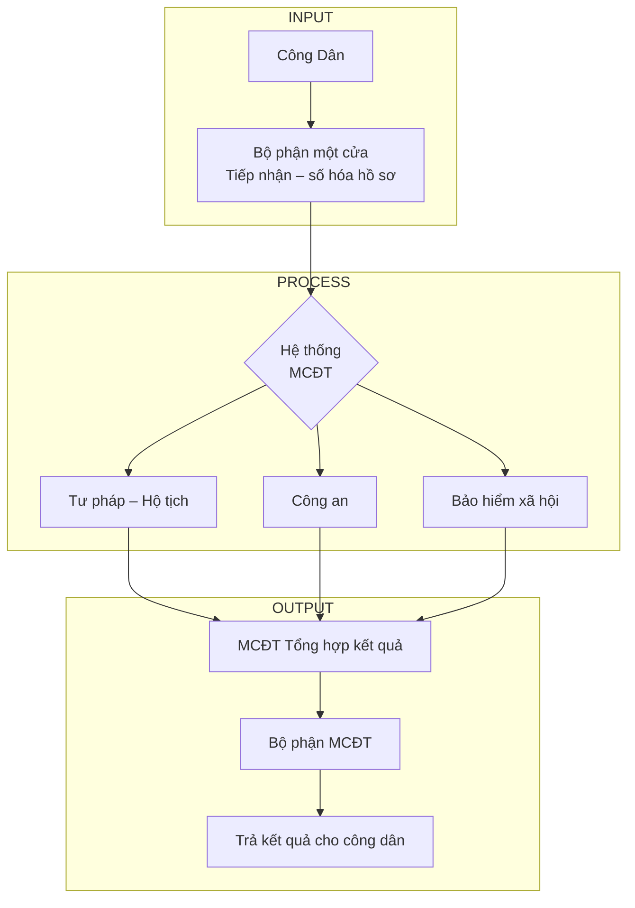
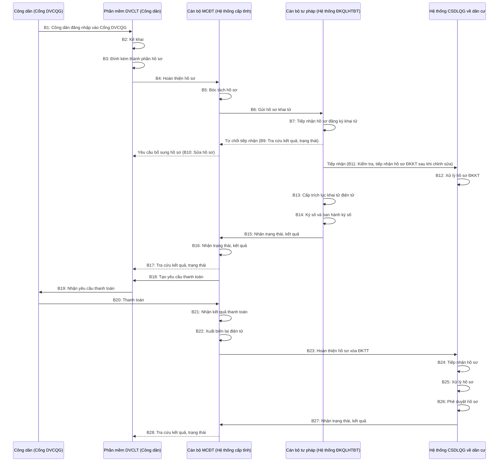
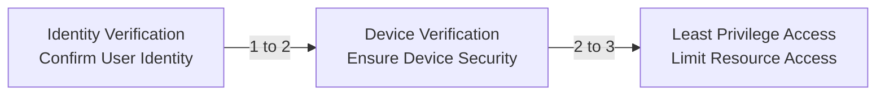

# BÁO CÁO TIỂU LUẬN: KHẢO SÁT HIỆN TRẠNG VÀ PHÂN TÍCH CƠ SỞ HẠ TẦNG CÔNG NGHỆ THÔNG TIN TẠI ỦY BAN NHÂN DÂN PHƯỜNG

**Trường:** Đại học Công nghệ Thông tin - ĐHQG - HCM
**Đơn vị:** Trung tâm Phát triển Công nghệ Thông tin - Khoa Khoa học và Kỹ thuật Thông tin
**Đề tài:** Khảo sát hiện trạng và phân tích cơ sở hạ tầng công nghệ thông tin tại Ủy ban nhân dân Phường
**Nhóm thực hiện:** Nhóm 3
**Giảng viên hướng dẫn:** Ths. Nguyễn Minh Tiến
**Năm học:** 2024 – 2025

## Thành viên

| STT | MSSV | Họ tên | Vai trò |
| :---: | :---: | :--- | :--- |
| 1 | 25410222 | Nguyễn Hồng Huân | Nhóm trưởng |
| 2 | 25410241 | Huỳnh Trần Đức Lập | Thành viên |
| 3 | 25410263 | Nguyễn Trọng Nghĩa | Thành viên |
| 4 | 25410310 | Lê Trung Thảo | Thành viên |
| 5 | 25410182 | Nguyễn Minh Đăng | Thành viên |
| 6 | 25410276 | Lương Tấn Phát | Thành viên |
| 7 | 25410287 | Lê Nguyễn Phương | Thành viên |
| 8 | 25410288 | Trần Nguyễn Minh Quân | Thành viên |
| 9 | 25410307 | Lê Thị Hoài Thanh | Thành viên |
| 10 | 25410223 | Lê Quốc Hưng | Thành viên |
| 11 | 25410185 | Nguyễn Phong Đạt | Thành viên |
| 12 | 25410252 | Dương Hồng Luyến | Thành viên |
| 13 | 25410257 | Nguyễn Tiến Minh | Thành viên |
| 14 | 25410206 | Nguyễn Đắc Hiển | Thành viên |
| 15 | 25410280 | Nguyễn Tiến Phi | Thành viên |
| 16 | 25410212 | Nguyễn Xuân Hiếu | Thành viên |
| 17 | 25410335 | Trần Phúc Vinh | Thành viên |

---

## Bảng Viết Tắt Và Ý Nghĩa

| Viết tắt | Ý nghĩa |
| :--- | :--- |
| **DVCLT** | Dịch vụ công liên thông |
| **TTHC** | Thủ tục hành chính |
| **MCĐT** | Hệ thống Một cửa điện tử |
| **TTMC** | Bộ phận/Trung tâm Một cửa |
| **TP–HT** | Tư pháp – Hộ tịch |
| **CSDLQGDC** | Cơ sở dữ liệu Quốc gia về Dân cư |
| **DVCQG** | Cổng Dịch vụ công Quốc gia |
| **BHXH** | Bảo hiểm xã hội |
| **BHYT** | Bảo hiểm y tế |
| **ĐKTT** | Đăng ký thường trú |
| **XĐKTT** | Xóa đăng ký thường trú |
| **HSTĐT** | Hồ sơ thủ tục điện tử |
| **KQXL** | Kết quả xử lý |
| **NSDLT** | Nền tảng số liệu liên thông |
| **TPHS** | Thành phần hồ sơ |
| **TPHSĐT** | Thành phần hồ sơ điện tử |
| **TTTP** | Thông tin Tư pháp |
| **MCD** | Mã số định danh |
| **CQCA** | Cơ quan Công an |
| **CQTP** | Cơ quan Tư pháp |
| **CQBHXH** | Cơ quan Bảo hiểm xã hội |
| **KSTT** | Kiểm soát thủ tục |
| **HSDT** | Hồ sơ điện tử |
| **LTLT** | Liên thông liên ngành |
| **BML** | Bảo mật Layer |

---

## Lời cảm ơn

Lời đầu tiên, nhóm em xin gửi lời cảm ơn tới Ban Giám hiệu nhà trường, các thầy cô thuộc các phòng ban, đặc biệt là các thầy cô tại Khoa Khoa học và Kỹ thuật Thông tin đã tạo điều kiện tốt nhất trong quá trình em tham gia học tập và nghiên cứu tại trường.

Đồng thời, nhóm em xin gửi lời cảm ơn chân thành và sâu sắc nhất tới **ThS. Nguyễn Minh Tiến**. Thầy đã trực tiếp hướng dẫn, tận tình chỉ bảo và truyền đạt những kiến thức quý báu để em có thể thực hiện đề tài nghiên cứu về "Hiện trạng và giải pháp nâng cấp hạ tầng mạng tại Ủy ban nhân dân Phường Tân Hải" một cách tốt nhất. Những định hướng của Thầy về công nghệ hạ tầng, bảo mật hệ thống và quy trình vận hành dịch vụ công liên thông đã giúp nhóm em hoàn thành bài tiểu luận với tính thực tiễn cao.

Mặc dù đã cố gắng tìm hiểu và đầu tư nhiều thời gian để làm bài luận, tuy nhiên do kiến thức chuyên môn và kinh nghiệm thực tế của bản thân còn hạn chế nên khó tránh khỏi những điều thiếu sót. Em rất mong nhận được những ý kiến đóng góp quý báu từ Thầy để em có thể hoàn thiện hơn bài viết này, cũng như rút kinh nghiệm cho những nghiên cứu sau này.

Em xin chân thành cảm ơn!

---

## CHƯƠNG I. GIỚI THIỆU VỀ ĐỀ TÀI

### 1. Lý do chọn đề tài

Trong bối cảnh Thành phố Hồ Chí Minh và cả nước đang quyết liệt triển khai mô hình chính quyền địa phương hai cấp, việc lấy người dân và doanh nghiệp làm trung tâm phục vụ đã trở thành nhiệm vụ trọng tâm. Để hiện thực hóa mục tiêu này, việc sở hữu một hạ tầng Công nghệ thông tin (CNTT) đồng bộ, hiện đại và an toàn là nhu cầu tất yếu.

Tuy nhiên, thực trạng tại nhiều Ủy ban nhân dân (UBND) cấp phường, xã cho thấy hệ thống CNTT hiện đang bộc lộ nhiều hạn chế:
- Thiết bị phần cứng đã xuống cấp, hạ tầng mạng chưa đáp ứng được yêu cầu vận hành của mô hình chính quyền mới.
- Công tác bảo đảm an toàn thông tin (ATTT) chưa tuân thủ đầy đủ các quy định pháp luật.
- Tình trạng nghẽn mạng gây gián đoạn các dịch vụ công trực tuyến, ảnh hưởng trực tiếp đến chất lượng phục vụ nhân dân.

Việc nghiên cứu và nâng cấp hạ tầng mạng tại **UBND Phường Tân Hải** không chỉ giúp đảm bảo hoạt động liên tục, ổn định của bộ máy hành chính mà còn tạo nền tảng vững chắc cho quá trình chuyển đổi số và xây dựng chính quyền số.

### 2. Nhu cầu bảo mật dữ liệu ngày càng quan trọng

Sự gia tăng đột biến về quy mô dữ liệu số sau khi sắp xếp địa giới hành chính đã biến hệ thống thông tin cấp xã trở thành mục tiêu tiềm năng của các cuộc tấn công mạng. Trong bối cảnh hạ tầng cũ còn sơ sài, nguy cơ mất an toàn thông tin đã trở thành rủi ro an ninh nghiêm trọng. Do đó, việc trang bị các giải pháp bảo mật theo tiêu chuẩn quốc gia là bước đi bắt buộc để bảo vệ dữ liệu hồ sơ công dân và duy trì niềm tin vào chính quyền số 4.0.

### 3. Mục tiêu nghiên cứu

#### 3.1. Mục tiêu tổng quát:
Khảo sát toàn diện hiện trạng hạ tầng CNTT tại UBND cấp xã, từ đó đề xuất phương án thiết kế và nâng cấp hệ thống mạng đảm bảo ba tiêu chí cốt lõi: **Ổn định – Bảo mật – Dễ dàng quản lý**.

#### 3.2. Mục tiêu cụ thể:
- **Khảo sát hiện trạng:** Thu thập sơ đồ mạng vật lý và logic, thống kê chi tiết số lượng, tình trạng hoạt động của các thiết bị phần cứng (Router, Switch, AP, PC...).
- **Phân tích truyền dẫn:** Đánh giá cách thức kết nối Internet, đường truyền số liệu chuyên dùng (TSLCD) và quy trình phân phối IP (DHCP).
- **Đánh giá & Đề xuất:** Xác định các "điểm nghẽn" và lỗ hổng bảo mật, ứng dụng kiến thức về VLAN, Firewall, VPN và cân bằng tải đa đường truyền để tối ưu hóa hệ thống.

### 4. Phạm vi và phương pháp nghiên cứu

#### 4.1. Không gian nghiên cứu:
Đề tài chỉ tập trung khảo sát và phân tích dựa trên mô hình của UBND cấp xã.
Không bao gồm việc can thiệp sâu vào hệ thống mạng diện rộng (WAN) của cấp tỉnh hay các đường truyền dữ liệu chuyên dụng.

#### 4.2. Đối tượng nghiên cứu:
- **Phần cứng mạng:** Router, Firewall, Switch Core/Access, thiết bị BML phục vụ văn bản Mật, Modem nhà mạng, hệ thống Wifi, hệ thống máy chủ và máy trạm.
- **Hệ thống cáp:** Hệ thống cáp quang (FTTH), cáp mạng LAN.
- **Phần mềm & Giao thức:** Các cấu hình trên thiết bị mạng như: **địa chỉ IP, DHCP, NAT, VLAN, Routing**, và các chính sách Firewall cơ bản (Filter Rule, Web Filter), các phần mềm, dịch vụ sử dụng phục vụ công việc: **Office, Unikey, Hệ thống Dịch vụ công, MISA, phần mềm kho bạc, ký số,...**
- **Dịch vụ mạng:** Tập trung vào sự ổn định của truy cập Internet, truy cập phần mềm Quản lý văn bản điều hành, Dịch vụ công và in ấn qua mạng LAN.

### 5. Giới thiệu sơ lược về UBND phường Tân Hải:

#### 5.1. Thông tin chung
- **Tên đơn vị:** Ủy ban nhân dân Phường Tân Hải
- **Địa chỉ:** QL51, Khu phố Láng Cát, Phường Tân Hải, TP. Hồ Chí Minh

#### 5.2. Chức năng nhiệm vụ:
UBND phường là cơ quan hành chính nhà nước ở địa phương, chịu trách nhiệm chấp hành Hiến pháp, pháp luật, các văn bản của cơ quan nhà nước cấp trên và Nghị quyết của Hội đồng nhân dân cùng cấp.

#### 5.3. Vai trò:
Là cầu nối trực tiếp nhất giữa Nhà nước và Nhân dân. UBND phường quản lý toàn diện các mặt đời sống kinh tế - xã hội, an ninh - quốc phòng trên địa bàn. Đặc biệt, đây là nơi thực hiện các thủ tục hành chính thiết yếu như: Đăng ký khai sinh, khai tử, kết hôn, chứng thực, các thủ tục kinh tế, văn hóa và các chế độ chính sách xã hội.

#### 5.4. Cơ cấu tổ chức và nhân sự:
Hệ thống chính trị tại UBND Phường Tân Hải được tổ chức theo mô hình thống nhất, đảm bảo tính liên thông dữ liệu giữa các khối nhưng vẫn duy trì sự biệt lập về an toàn thông tin theo quy định.

**a. Bảng tổng hợp chức năng và nhu cầu CNTT theo khối**

| Khối chức năng | Các bộ phận trực thuộc | Đặc điểm và Nhu cầu CNTT |
| :--- | :--- | :--- |
| **Khối Đảng** | Thường trực Đảng ủy, Văn phòng, Ban Tổ chức, Ban Tuyên giáo, Ủy ban Kiểm tra. | Bảo mật nghiêm ngặt; sử dụng phần mềm Quản lý Đảng viên, Kiểm tra Đảng; yêu cầu kết nối ổn định tới Trung tâm dữ liệu Tỉnh ủy. |
| **Khối Nhà nước** | Lãnh đạo HĐND & UBND, các phòng chuyên môn (Kinh tế, Văn hóa - Xã hội), Bộ phận Một cửa. | Lưu lượng mạng lớn nhất; vận hành hệ thống Một cửa điện tử, iDesk, Cổng DVC trực tuyến; là nơi chính phát sinh các quy trình dịch vụ công. |
| **Khối Đoàn thể** | UBMTTQVN, Đoàn Thanh niên, Hội Phụ nữ, Hội Nông dân, Hội Cựu chiến binh. | Phục vụ hội họp, tuyên truyền; sử dụng WiFi công cộng và các ứng dụng văn phòng cơ bản. |

**b. Sơ đồ tổ chức:**



### 6. Hiện trạng ứng dụng CNTT tại đơn vị
Hiện nay, UBND Phường Tân Hải đã đạt được một số kết quả nhất định trong ứng dụng CNTT:
- **Phần mềm:** 100% cán bộ sử dụng phần mềm iDesk, chữ ký số chuyên dùng và hệ thống Một cửa điện tử liên thông.
- **Thiết bị:** Đảm bảo mỗi cán bộ đều có máy tính, máy scan và máy in kết nối mạng.
- **Thách thức:** Số lượng thiết bị tăng nhanh cùng nhu cầu WiFi công cộng cho người dân đang gây áp lực lớn, dẫn đến tình trạng quá tải và mất kết nối cục bộ. Việc nâng cấp hạ tầng mạng là yêu cầu bắt buộc để duy trì chất lượng phục vụ nhân dân.

---

## CHƯƠNG II. HIỆN TRẠNG CƠ SỞ HẠ TẦNG CNTT

### 1. Các thành phần cấu tạo cơ sở hạ tầng CNTT tại UBND phường
Cơ sở hạ tầng (CSHT) CNTT tại UBND Phường Tân Hải được xây dựng đồng bộ nhằm phục vụ công tác quản lý hành chính và dịch vụ công trực tuyến.
Hệ thống bao gồm các thành phần chính sau:

#### 1.1 Hạ tầng mạng (Network Infrastructure)
Hạ tầng mạng tại UBND phường đóng vai trò nền tảng trong việc kết nối các phòng ban nội bộ, liên thông dữ liệu với các cơ quan cấp trên và cung cấp truy cập dịch vụ CNTT cho cán bộ cũng như người dân.

**Sơ đồ tổng quan hệ thống hạ tầng mạng**



Hệ thống mạng được thiết kế theo mô hình dự phòng, đảm bảo kết nối nội bộ ổn định và liên thông dữ liệu với các cơ quan cấp trên.
Các thiết bị như **Firewall, Coreswitch, Router** đóng vai trò quan trọng trong việc phân phối và định tuyến toàn bộ lưu lượng mạng giữa các vùng mạng trong hệ thống. Để đảm bảo tính dự phòng, các thiết bị sẽ được tăng cường kết hợp với các tính năng như **HA, Stacking, VRRP**.
Hệ thống mạng được phân tách rõ ràng giữa mạng nội bộ và mạng dùng riêng chuyên ngành, đảm bảo an toàn thông tin tuyệt đối.

**a. Sơ đồ Logic và Phân vùng mạng (VLAN)**
Hệ thống được thiết kế theo mô hình hình sao (Star Topology) với trung tâm là cụm Core Switch Layer 3, chia thành các phân vùng quản lý riêng biệt:
- **Vùng Máy chủ nội bộ (VLAN 9):** Đặt các máy chủ dịch vụ tập trung.
- **Vùng Mạng Nội bộ (VLAN 11-19):** Kết nối các máy tính trạm của cán bộ công chức các phòng ban.
- **Vùng Mạng Quản trị (VLAN 10):** Dùng để quản lý, cấu hình các thiết bị mạng trong hệ thống.
- **Vùng Camera và IoT (VLAN 20):** Cách ly lưu lượng từ hệ thống giám sát và thiết bị thông minh.
- **Vùng Mạng Không dây (VLAN 21-22):** Bao gồm SSID Office (nội bộ) và SSID Guest (người dân).

**b. Kết nối WAN và Internet**
- **Mạng LAN và WAN:** Sử dụng **02 đường truyền Internet 300Mbps** (VNPT & Viettel) cho mục đích vận hành nội bộ và công cộng. Hệ thống truyền số liệu chuyên dùng (TSLCD) **sử dụng 02 đường Metronet 1Gbps** (Chính và Dự phòng) để kết nối an toàn về Trung tâm dữ liệu Thành phố.
- **Công nghệ kết nối:** Ứng dụng SD-WAN Load Balancing để cân bằng tải và tự động chuyển đổi đường truyền khi có sự cố (Failover).
- **Mạng không dây (WLAN):** Sử dụng hệ thống WiFi **Cisco Aironet 1800**, quản lý tập trung thông qua **Cisco WLC 3504**, cho phép cấu hình SSID, quản lý truy cập, roaming và bảo mật mạng không dây.

**c. Bảng thống kê hiện trạng đường truyền và công nghệ kết nối mạng diện rộng**

| Hạng mục | Internet nội bộ | Internet Truyền số liệu chuyên dùng (TSLCD) |
| :--- | :--- | :--- |
| **Cấu hình vật lý** | **02 Đường truyền Internet 300Mbps**<br>01 đường VNPT (Load Balance + Failover)<br>01 đường Viettel (Load Balance + Failover) | **02 Đường truyền Metronet 1Gbps**<br>01 đường Chính (Primary).<br>01 đường Dự phòng (Backup). |
| **Công nghệ kết nối** | **SD-WAN Load Balancing:**<br>Thiết lập Performance SLA (độ trễ, mất gói) cho từng đường VNPT & Viettel.<br>Khi cả hai đường đạt SLA → **chia tải 50/50** giữa 2 đường Internet.<br>Khi một đường không đạt SLA → **tự động dồn toàn bộ lưu lượng sang đường còn lại** (failover) | **Active - Passive (Dự phòng nóng):**<br>Đảm bảo kết nối điểm - điểm (P2P) về Trung tâm dữ liệu Thành phố. |
| **Vai trò & Đối tượng** | **Phục vụ Vận hành & Công cộng:**<br>• **Cán bộ:** Tra cứu thông tin, Email, Zalo công vụ.<br>• **Người dân:** Wifi miễn phí (SSID Guest) tại bộ phận Một cửa.<br>• **Hệ thống:** Đẩy dữ liệu ra Cổng Dịch vụ công trực tuyến. | **Phục vụ Nghiệp vụ:**<br>• Truy cập **CSDL Quốc gia về dân cư**.<br>• Hệ thống Quản lý văn bản, Thư công vụ TPHCM.<br>• Hội nghị truyền hình trực tuyến (Giao ban). |
| **Mức độ bảo mật** | **Mạng Công cộng:** Được kiểm soát truy cập và bảo vệ bởi Tường lửa (Firewall) | **Mạng Dùng riêng:** Cách ly hoàn toàn với Internet, đảm bảo an toàn tuyệt đối cho dữ liệu mật. |

**d. Cơ chế sẵn sàng cao**
Tính high availability (HA) hay còn gọi là khả năng sẵn sàng cao, là một khái niệm rất phổ biến trong công nghệ thông tin mạng và bảo mật, cho phép khả năng của một hệ thống hoặc thành phần của hệ thống luôn **sẵn sàng hoạt động và cung cấp dịch vụ mà không bị gián đoạn**.


*Sơ đồ cơ chế High Availability (HA) và dự phòng hệ thống*

#### 1.2 Hạ tầng máy chủ & lưu trữ (Server & Storage Infrastructure)
**a. Cấu hình phần cứng máy chủ vật lý**
Hạ tầng máy chủ và lưu trữ tại UBND phường được triển khai theo mô hình tập trung trên nền tảng ảo hóa Hyper-V nhằm tối ưu hóa hiệu năng và khả năng quản trị.
Đơn vị trang bị hệ thống máy chủ kép đảm bảo khả năng xử lý mạnh mẽ và dự phòng thảm họa.
- **Model thiết bị:** 02 máy chủ vật lý **Dell PowerEdge R740**.
- **Năng lực xử lý:** CPU ≥ 16 nhân/32 luồng, xung nhịp 3.0GHz.
- **Bộ nhớ:** RAM 64GB (2x32GB RDIMM, 5600MT/s).
- **Hệ thống lưu trữ: 02 ổ SSD 480GB** cấu hình **RAID 1** dành cho hệ điều hành (đảm bảo tính sẵn sàng).
  - **04 ổ SSD 960GB** cấu hình **RAID 5** dành cho lưu trữ dữ liệu (tổng dung lượng khả dụng ~2.7TB).

**b. Danh mục các máy chủ ảo (Virtual Machines - VMs)**

| Tên máy chủ | Chức năng chính | Cấu hình (vCPU/RAM) | Lưu trữ (Storage) | Hệ điều hành |
| :--- | :--- | :--- | :--- | :--- |
| **AD – Domain Controller** | Xác thực người dùng, quản lý tài khoản tập trung và áp dụng chính sách bảo mật (GPO) | 4 vCPU / 16GB RAM | **200 GB** (Gồm 100GB OS RAID 1 và 100GB Data RAID 5). | Windows Server 2019 |
| **File Server** | Lưu trữ tập trung hồ sơ phòng ban, phân quyền truy cập và chia sẻ dữ liệu nội bộ. | 4 vCPU / 16GB RAM | **2.6 TB** (Gồm 100GB OS RAID 1 và 2.5TB Data RAID 5) | Virtual DSM (NAS Synology ảo) |
| **Access Control Server** | Kết nối hệ thống cửa từ; quản lý danh sách nhân sự và ghi log báo cáo lịch sử ra vào. | 4 vCPU / 8GB RAM | **200 GB** (Gồm 100GB OS RAID 1 và 100GB Data RAID 5) | Windows Server 2019 |

**c. Cơ chế dự phòng và Khôi phục thảm họa**
Hệ thống vận hành theo mô hình **Active – Passive** sử dụng công nghệ **Hyper-V Replica** để đảm bảo tính liên tục của dịch vụ :
- **Nguyên lý vận hành:** Máy chủ vật lý thứ nhất (SV1) đóng vai trò chính (Primary), máy chủ thứ hai (SV2) đóng vai trò dự phòng (Replica).
- **Chu kỳ đồng bộ:** Các tệp đĩa ảo (VHDX) của các máy chủ ảo trên SV1 được sao chép sang SV2 theo **chu kỳ 30 giây/lần**.
- **Kịch bản xử lý sự cố (Failover):** Khi SV1 gặp sự cố phần cứng, quản trị viên thực hiện lệnh Failover trên SV2 .
Các máy chủ ảo sẽ được khởi động trực tiếp trên SV2 với dữ liệu đã được đồng bộ gần nhất.
- **Đặc điểm:** Cơ chế này cho phép khôi phục nhanh hệ thống nhưng chấp nhận một khoảng thời gian mất dữ liệu nhỏ (tối đa 30 giây) do không phải là đồng bộ thời gian thực.

#### 1.3 Hạ tầng bảo mật
Hệ thống bảo mật được xây dựng theo nguyên tắc phòng thủ nhiều lớp nhằm bảo vệ an toàn cho dữ liệu công dân và các hệ thống nghiệp vụ chuyên ngành.
- **Tường lửa (Firewall):** Sử dụng cụm 02 thiết bị **Fortinet 100F** chạy chế độ dự phòng nóng **(High Availability - HA)**. Firewall thực thi các chính sách kiểm soát lưu lượng ra vào mạng và áp dụng tính năng **UTM (Unified Threat Management)** bao gồm lọc nội dung web **(Web Filter)**, chống virus và ngăn chặn xâm nhập **(IPS)**.
- **Bảo vệ thiết bị đầu cuối (Endpoint Security):** Đơn vị hiện đang sử dụng công cụ bảo mật tích hợp Windows Defender kết hợp với các chính sách nhóm **(Group Policy - GPO)** từ máy chủ **Active Directory** để quản lý mật khẩu, khóa màn hình, không cắm USB và kiểm soát các cài đặt hệ thống trên máy tính của cán bộ.
- **Kiểm soát truy cập vật lý:** Khu vực phòng máy chủ (Server Room) được bảo vệ bằng hệ thống cửa từ, camera giám sát 24/7 và chỉ những nhân sự được ủy quyền mới có quyền ra vào.

#### 1.4 Các công nghệ điều phối và truyền dẫn dữ liệu
**a. Công nghệ định tuyến (Routing)**
- **Nguyên lý vận hành:** Định tuyến là quá trình lựa chọn và xác định đường đi tối ưu cho lưu lượng các gói IP trong nội bộ mạng hoặc kết nối giữa các mạng khác nhau. Quá trình này giúp quản lý và điều phối tổng thể lưu lượng mạng một cách khoa học.
- **Triển khai thiết bị:** Chức năng này được thực thi đồng bộ trên hệ thống Tường lửa (Firewall), Bộ định tuyến (Router) và Thiết bị chuyển mạch lớp 3 (Switch Layer 3).
- **Cấu trúc hạ tầng:** Routing đóng vai trò là lớp **Underlay Network** lớp mạng truyền tải vật lý và logic dùng để kết nối các nút mạng với nhau. Đây là nền móng để các dịch vụ **Overlay** chạy ổn định thông qua **Internet, MPLS** hoặc **LTE**.
- **Thực tế ứng dụng:** Lưu lượng Internet của Ủy ban được kiểm soát bởi các chính sách bảo mật và định tuyến qua đường truyền FTTH.
- Các lưu lượng nghiệp vụ nội bộ được ưu tiên định tuyến qua giải pháp **SD-WAN** để đảm bảo tính riêng tư và tốc độ.

**b. Công nghệ SD-WAN (Software-Defined WAN)**
- **Định nghĩa:** Đây là phương thức quản lý mạng diện rộng giúp tăng cường khả năng kết nối, bảo mật và hiệu suất cho các ứng dụng công vụ hiện đại.
- **Ứng dụng thực tế:** Ủy ban tận dụng hạ tầng Metronet – MPLS của nhà cung cấp VNPT để triển khai quản lý tập trung thông qua giải pháp Cisco SD-WAN.
- **Lợi ích:** Giải pháp này giúp kết nối liên thông các đơn vị với Trung tâm dữ liệu (Data Center) và cung cấp khả năng mã hóa dữ liệu đường truyền ở mức độ cao.

**c. Chính sách kiểm soát truy cập (Firewall Policy)**
Hệ thống tường lửa được thiết lập nhằm điều tiết luồng dữ liệu an toàn, đảm bảo cân bằng giữa hiệu năng công việc và bảo mật hạ tầng. Các chính sách chính bao gồm:
- **Quản lý đối tượng:** Sử dụng các quy tắc (Rules) dựa trên IP, Network và Zone để phân quyền truy cập chi tiết cho từng phòng ban.
- **Điều tiết Internet:** Kiểm soát truy cập mạng công cộng, ưu tiên băng thông cho các ứng dụng công vụ và cổng thông tin chính phủ.
- **Bảo mật UTM:** Tích hợp các tính năng Web Filter và IPS để quét, lọc mã độc và ngăn chặn các hành vi xâm nhập trái phép.
- **Phân quyền nội bộ:** Cấp quyền truy cập dịch vụ theo đúng chức năng và nhiệm vụ, hạn chế tối đa việc tiếp xúc với các vùng dữ liệu ngoài phạm vi chuyên môn.

#### 1.5 Hệ thống ứng dụng – dịch vụ
Đây là lớp ứng dụng trực tiếp phục vụ hoạt động nghiệp vụ của cán bộ và cung cấp dịch vụ cho người dân :
- **Hệ thống Quản lý văn bản và điều hành (iDesk):** Phục vụ 100% cán bộ công chức trong việc gửi/nhận văn bản điện tử và ký số chuyên dùng.
- **Hệ thống Một cửa điện tử liên thông:** Tiếp nhận và xử lý hồ sơ thủ tục hành chính trực tiếp và trực tuyến.
- **Cổng Dịch vụ công Quốc gia:** Giao diện tương tác chính giữa công dân và chính quyền trong việc nộp hồ sơ trực tuyến.
- **Hệ thống chuyên ngành:** Bao gồm phần mềm Hộ tịch điện tử, phần mềm Kế toán MISA, Kho bạc và hệ thống Hội nghị trực tuyến (Zoom/Polycom) phục vụ giao ban.

#### 1.6 Hệ thống thiết bị đầu cuối chuyên dụng
Bên cạnh các ứng dụng phần mềm, đơn vị trang bị các hệ thống phần cứng chuyên dụng để hỗ trợ công tác quản lý và điều hành từ xa.

**a. Hệ thống Hội nghị trực tuyến**
- **Thiết bị:** Polycom RealPresence Group Series.
- **Đặc điểm:** Hỗ trợ truyền tải video và âm thanh độ phân giải cao, đảm bảo tín hiệu ổn định và mượt mà.
- **Giá trị vận hành:** Kết nối hội họp giữa các chi nhánh và đối tác, giúp tối ưu hóa chi phí đi lại và nâng cao hiệu quả làm việc.

**b. Hệ thống Camera an ninh**
- **Thiết bị:** Camera IP Hikvision DS-2CD2085FWD-I (Số lượng: 22 cái).
- **Thông số kỹ thuật:** Độ phân giải 4K (8MP), cho hình ảnh sắc nét trong mọi điều kiện ánh sáng.
- **Tính năng thông minh:** Tích hợp AI hỗ trợ phát hiện chuyển động và nhận diện khuôn mặt.
- **Hạ tầng kết nối:** Hoạt động trên phân vùng mạng riêng biệt (VLAN 20) để đảm bảo an ninh và không gây ảnh hưởng đến băng thông mạng nghiệp vụ.

### 2. Bảng thống kê thiết bị khảo sát

#### 2.1 Danh mục thiết bị hạ tầng hệ thống

| No. | Device | Description | Model | Quantity |
| :---: | :--- | :--- | :--- | :---: |
| **1** | Cisco Router | WAN Router | C1111 | 2 |
| **2** | Cisco Switch | CoreSwitch | C9300 | 2 |
| **3** | Cisco Switch | Access Swtich (no POE) | C9200 | 5 |
| **4** | Cisco Switch | Access Swtich (POE) | SG350 | 2 |
| **5** | Dell Server | AD, File SV, Access Control | R740 | 2 |
| **6** | Cisco Aironet | Access Point | 1800 | 8 |
| **7** | Cisco WLC | Wireless Controler | 3504 | 1 |
| **8** | Fortinet Firewall | Firewall | 100F | 2 |
| **9** | Camera Hikvision | Camera | DS-2CD2085FWD-I | 22 |
| **10** | NVR | Đầu ghi hình camera 32 kênh | DS-7732NI-I4 | 1 |

#### 2.2 Thống kê thiết bị đầu cuối theo phòng ban

| STT | Phòng ban | CBCC | Máy tính | Máy In | Máy scan (Quét) | Switch | AP |
| :---: | :--- | :---: | :--- | :---: | :---: | :---: | :---: |
| **1** | Văn phòng | **17** | 14 (1 máy chuyên xử lý văn bản mật) | 05 | 02 | 02 | 01 |
| **2** | Phòng Văn hoá – Xã hội | **10** | 08 | 02 | 01 | 01 | 01 |
| **3** | Phòng Kinh tế | **13** | 07 | 02 | 01 | 01 | 01 |
| **4** | Trung Tâm Hành Chính Công | **10** | 10 | 10 | 05 | 01 | 01 |
| **5** | Văn phòng Đảng ủy | **15** | 15 (1 máy chuyên xử lý văn bản mật) | 08 | 05 | 01 | 01 |
| **6** | Ban Xây dựng Đảng | **12** | 12 (1 máy chuyên xử lý văn bản mật) | 06 | 05 | 01 | 01 |
| **7** | Ủy ban kiểm tra | **10** | 10 (1 máy chuyên xử lý văn bản mật) | 05 | 05 | 01 | 01 |
| **8** | UBMTTQVN | **12** | 12 | 05 | 05 | 01 | 01 |
| **9** | Khu vực người dân | **-** | - | - | - | - | 01 |
| | **Tổng cộng** | **99** | **94** | **43** | **29** | **9** | **9** |

#### 2.3 Thống kê thiết bị tủ Rack – Server

| Thiết bị | Router | Switch | Firewall | Server | NVR |
| :--- | :---: | :---: | :---: | :---: | :---: |
| **Số lượng** | 2 | 3 | 2 | 2 | 1 |

---

## CHƯƠNG III. QUY TRÌNH HOẠT ĐỘNG TẠI CƠ QUAN

### 1. Mô hình vận hành tổng quát:
Hệ thống vận hành theo cơ chế **Dịch vụ công liên thông** với nguyên tắc cốt lõi: **"Một cửa – Một lần nộp – Liên thông điện tử"**.
- **Cơ chế:** Công dân chỉ cần nộp hồ sơ tại một đầu mối duy nhất là bộ phận Một cửa.
- **Vận hành:** Việc luân chuyển hồ sơ giữa các phòng ban chuyên môn được thực hiện hoàn toàn tự động trên môi trường mạng, giúp giảm thiểu tối đa việc đi lại và bổ sung giấy tờ cho người dân.
- **Vai trò trung tâm:** Hệ thống Một cửa điện tử (MCĐT) đóng vai trò trung tâm điều phối dữ liệu giữa các cơ quan chuyên ngành, số hóa toàn bộ quá trình tiếp nhận, xử lý và trả kết quả.

### 2. Quy trình xử lý và Dòng chảy dữ liệu

#### 2.1 Tiếp nhận và Phân luồng (Input)
**Bước 1: Tiếp nhận và Phân luồng (Input)**
- **Bộ phận Một cửa:** Tiếp nhận hồ sơ trực tiếp hoặc trực tuyến từ Cổng DVC Quốc gia và thực hiện số hóa dữ liệu (sử dụng máy scan và máy tính đã khảo sát tại Chương II).
- **Hệ thống MCĐT:** Tự động bóc tách dữ liệu và phân luồng hồ sơ đến các bộ phận chuyên môn tương ứng trên môi trường mạng.

**Bước 2: Xử lý nghiệp vụ chuyên ngành (Process)**
Hồ sơ được xử lý song song hoặc tuần tự tại các đơn vị thông qua kết nối liên thông dữ liệu qua mạng Metronet:
- **Tư pháp – Hộ tịch:** Xử lý nghiệp vụ khai sinh, khai tử trên phần mềm Hộ tịch điện tử.
- **Công an:** Xác thực thông tin cư trú thông qua kết nối với Cơ sở dữ liệu quốc gia về dân cư.
- **Bảo hiểm xã hội:** Cấp thẻ BHYT và giải quyết chế độ thông qua hệ thống Bảo hiểm xã hội liên thông.

**Bước 3: Tổng hợp và Trả kết quả (Output)**
- **Hệ thống:** Tổng hợp các kết quả xử lý rời rạc từ các đơn vị thành một bộ kết quả đồng bộ.
- **Trả kết quả:** Bộ phận Một cửa trả kết quả cuối cùng cho công dân, đảm bảo tính chính xác và giảm thiểu thủ tục giấy tờ.

### 3. Mô hình khái quát:
Quy trình dịch vụ công liên thông tại UBND phường được tổ chức theo mô hình **“Một cửa – Một lần nộp – Liên thông điện tử”**.
- **Vai trò trung tâm:** Hệ thống Một cửa điện tử (MCĐT) đóng vai trò trung tâm điều phối dữ liệu giữa các cơ quan chuyên ngành.
- **Mục tiêu:** Toàn bộ quá trình tiếp nhận, xử lý và trả kết quả được số hóa trên môi trường mạng, giúp giảm thiểu thao tác thủ công và nâng cao hiệu quả phục vụ người dân.

### 4. Lược đồ mô hình hoạt động



### 5. Giải thích quy trình xử lý và Dòng chảy dữ liệu (Input - Process - Output)
- **Bước 1: Tiếp nhận hồ sơ:** Số hóa và nhập liệu.
- **Bước 2: Xác thực thông tin:** Đối chiếu tự động với CSDL Quốc gia về Dân cư.
- **Giai đoạn 3: Bóc tách TTHC:** Tự động tách các thủ tục tương ứng.
- **Giai đoạn 4: Chuyển liên thông:** Gửi dữ liệu đến Tư pháp, Công an, BHXH.
- **Giai đoạn 5: Tổng hợp kết quả:** Đồng bộ phản hồi từ các cơ quan.
- **Giai đoạn 6: Trả kết quả:** Trực tiếp hoặc trực tuyến qua tài khoản công dân.

### 6. Vai trò của hệ thống Một cửa điện tử
Trong toàn bộ mô hình DVCLT, hệ thống Một cửa điện tử giữ vai trò trung tâm:
- Là nơi nhận và số hóa hồ sơ ban đầu.
- Là bộ máy “bóc tách” và phân luồng thủ tục.
- Là điểm kết nối giữa công dân và các cơ quan xử lý.
- Là nơi công dân theo dõi trạng thái hồ sơ.
- Là nơi tổng hợp và trả kết quả cuối cùng.
Nói cách khác, hệ thống MCĐT là “bản điều phối” giúp toàn bộ quy trình vận hành thống nhất.

**Quy trình liên thông đăng ký khai tử, xóa đăng ký thường trú**



### 7. Vai trò của hạ tầng CNTT trong mô hình vận hành
Hạ tầng CNTT đóng vai trò là xương sống, đảm bảo sự phối hợp nhịp nhàng giữa các bước trong quy trình "Một cửa – Liên thông điện tử". Vai trò cụ thể của từng thành phần bao gồm:

**a. Hệ thống mạng và kết nối WAN:**
- Cụm **Router Cisco C1111** và **Core Switch C9300** đảm bảo đường truyền Metronet 1Gbps và Internet luôn thông suốt, phục vụ việc luân chuyển dữ liệu liên vùng (Bước 2: Process).
- Cơ chế dự phòng và cân bằng tải (SD-WAN) giúp duy trì kết nối ổn định giữa UBND phường với các hệ thống cấp Thành phố và Trung ương.

**b. Hệ thống Máy chủ (Server) và Lưu trữ:**
- Hai máy chủ **Dell PowerEdge R740** vận hành nền tảng quản trị người dùng (AD) và phần mềm Một cửa điện tử, iDesk.
- Đây là nơi lưu trữ tập trung toàn bộ cơ sở dữ liệu hồ sơ từ lúc tiếp nhận (Input) cho đến khi trả kết quả (Output), đảm bảo tính toàn vẹn và dễ dàng tra cứu.

**c. Hệ thống Bảo mật và Giám sát:**
- Cụm **Firewall Fortinet 100F** thực hiện kiểm soát truy cập và bảo vệ luồng dữ liệu liên thông, ngăn chặn các nguy cơ tấn công mạng từ bên ngoài.
- Hệ thống **22 Camera IP Hikvision** và **đầu ghi NVR** giám sát trực tiếp tính minh bạch tại khu vực tiếp nhận hồ sơ, đồng thời bảo vệ an ninh vật lý cho phòng máy chủ.

**d. Thiết bị đầu cuối và công cụ hỗ trợ:**
- Hệ thống **94 máy tính** và **29 máy scan** là công cụ trực tiếp giúp cán bộ số hóa hồ sơ giấy thành dữ liệu điện tử ngay tại **Bước 1**.
- Các thiết bị in ấn hỗ trợ việc xuất kết quả và văn bản hành chính tại **Bước 3** để trả cho công dân.

---

## CHƯƠNG IV. ĐÁNH GIÁ VÀ ĐỀ XUẤT CẢI TIẾN

### 1. Đánh giá sơ bộ về hiện trạng hạ tầng CNTT
Dựa trên hệ thống cơ sở hạ tầng hiện tại của Ủy ban nhân dân Phường Tân Hải, nhóm đã phân tích các mặt đã đạt được và các điểm còn tồn tại như sau:

#### 1.1 Những mặt hệ thống đã đáp ứng (Ưu điểm):
Hệ thống hạ tầng CNTT tại đơn vị đã được xây dựng bài bản, đạt được các tiêu chuẩn về tính sẵn sàng, hiệu năng và an toàn dữ liệu:

**a. Tính sẵn sàng cao (High Availability - HA) và dự phòng thảm họa:**
- Các thiết bị cốt lõi như cụm **02 Firewall Fortinet 100F, Core Switch C9300 và Gateway Router** đều được thiết lập chế độ dự phòng nóng **(Active-Passive hoặc Stacking/VRRP)**. Cơ chế này đảm bảo khi một thiết bị gặp sự cố, thiết bị còn lại sẽ tự động tiếp quản dịch vụ ngay lập tức, giúp hệ thống **vận hành liên tục 24/7** không bị gián đoạn.
- Hệ thống máy chủ Dell PowerEdge R740 kép **vận hành theo mô hình Active-Passive** với công nghệ **Hyper-V Replica**, thực hiện đồng bộ dữ liệu mỗi **30 giây**. Điều này cho phép **khôi phục nhanh chóng** các máy chủ ảo (VMs) trong trường hợp xảy ra lỗi phần cứng nghiêm trọng.
- Kết nối Internet sử dụng **SD-WAN Load Balancing** trên hai đường truyền VNPT và Viettel, tự động chuyển đổi (Failover) khi một trong hai đường gặp sự cố, đảm bảo kết nối ra Cổng dịch vụ công luôn thông suốt.

**b. Kiểm soát an ninh vật lý và giám sát hiện đại:**
- Khu vực phòng Server được bảo vệ bằng hệ thống cửa từ, mật khẩu, ngăn chặn tuyệt đối các truy cập trái phép từ bên ngoài vào hạ tầng thiết bị cốt lõi.
- Hệ thống 22 Camera IP Hikvision độ phân giải 4K (8MP) tích hợp trí tuệ nhân tạo (AI) cho phép giám sát thông minh, nhận diện khuôn mặt và phát hiện các hành vi bất thường tại các khu vực nhạy cảm.

#### 1.2 Những mặt còn hạn chế và thách thức (Nhược điểm)
- **Hệ thống quản trị:** Còn thiếu giải pháp giám sát tập trung (Monitoring) và quản lý nhật ký (Logging) chuyên sâu để hỗ trợ quản trị viên phát hiện sớm các rủi ro.
- **Hiệu năng mạng:** Đang có dấu hiệu quá tải WiFi cục bộ do lượng người dân truy cập tại bộ phận Một cửa tăng nhanh.
- MPLS vốn có chi phí cao hơn hơn Internet 5–10 lần/Mbps. **Khi dùng SD-WAN trên MPLS làm giảm giá trị của SD-WAN**, trong khi SD-WAN sinh ra dùng để **tối ưu hóa đường truyền**, thay thế cho **MPLS**.
- Cấu hình thiết bị phức tạp dẫn đến chi phí vận hành cao, khi phải cần có chuyên viên level cao để có thể vận hành trơn tru hệ thống và troubleshoot khi xảy ra sự cố.

#### 1.3 Phân tích kỹ thuật các hệ thống ứng dụng trọng yếu

**a. Bảng phân loại cấp độ an toàn hệ thống thông tin**
Bảng tổng hợp 5 cấp độ an toàn hệ thống thông tin theo tiêu chuẩn Nhà nước (Nghị định 85/2016/NĐ-CP)

| Cấp độ | Tầm quan trọng & Phạm vi | Mức độ thiệt hại khi có sự cố |
| :--- | :--- | :--- |
| **Cấp độ 1** | Hệ thống phục vụ nội bộ cơ quan, không cung cấp dịch vụ trực tiếp cho người dân. | Tổn hại thấp, chỉ ảnh hưởng cục bộ trong phạm vi hẹp. |
| **Cấp độ 2** | Hệ thống phục vụ hoạt động chuyên ngành của đơn vị. | Tổn hại trung bình, ảnh hưởng đến hoạt động hành chính thường nhật. |
| **Cấp độ 3** | Hệ thống dùng chung cấp Thành phố/Tỉnh, phục vụ hàng nghìn cán bộ và người dân địa phương. | Nghiêm trọng: Gây gián đoạn dịch vụ công trực tuyến, ảnh hưởng đến lợi ích của người dân toàn địa phương. |
| **Cấp độ 4** | Hệ thống trọng yếu Quốc gia, xử lý dữ liệu nhạy cảm của hàng triệu người dân toàn quốc. | **Đặc biệt nghiêm trọng:** Ảnh hưởng lớn đến kinh tế - xã hội, trật tự an toàn xã hội. |
| **Cấp độ 5** | Hệ thống phục vụ mục tiêu an ninh, quốc phòng quốc gia. | **Thảm họa:** Gây tổn hại đặc biệt nghiêm trọng đến an ninh quốc gia. |

**b. Bảng phân tích sâu về năng lực vận hành của các phần mềm nghiệp vụ tại đơn vị:**

| Hệ thống | Đặc điểm hạ tầng & Chịu tải | ATTT (Mức độ) |
| :--- | :--- | :--- |
| **Cổng DVCQG** | Cloud tập trung, thiết kế Elastic Scalability phục vụ hàng triệu người dùng. | Mức độ 4 |
| **Một cửa Điện tử** | Hệ thống trọng yếu cấp Thành phố, chịu tải hàng nghìn hồ sơ/giờ. | Mức độ 3 - 4 |
| **Quản lý Văn bản** | Phục vụ 100% CCVC, yêu cầu tốc độ xử lý và tra cứu nhanh. | Mức độ 3 |
| **Quản lý Hộ tịch** | Tập trung toàn quốc, ưu tiên tuyệt đối tính toàn vẹn dữ liệu. | Mức độ 4 |
| **Zoom Meetings** | Linh hoạt trên nhiều thiết bị, phục vụ họp và tập huấn từ xa. | Bảo mật mật khẩu & phòng chờ |

**c. Phân tích tương thích thực tế tại đơn vị giữa hạ tầng và phần mềm**

**❖ Xác định cấp độ hệ thống:**
- **Hệ thống Một cửa điện tử và Quản lý văn bản (iDesk):** Được xác định thuộc Cấp độ 3 do đây là các hệ thống dùng chung cấp Thành phố, phục vụ hàng nghìn cán bộ và người dân địa phương.
- **Cổng Dịch vụ công Quốc gia và Quản lý Hộ tịch:** Thuộc Cấp độ 4 vì xử lý dữ liệu nhạy cảm của hàng triệu công dân và có tầm quan trọng đặc biệt đối với kinh tế - xã hội toàn quốc.

**❖ Mức độ đáp ứng của hạ tầng bảo mật và HA:**
- Đối với các hệ thống Cấp độ 3 và 4, việc trang bị cụm Firewall Fortinet 100F đóng vai trò quan trọng trong việc triển khai các tính năng **UTM (như Web Filter, IPS)** để bảo vệ dòng dữ liệu liên thông.
- Việc thiết lập cấu hình **High Availability (HA)** và dự phòng thiết bị **(như 02 Firewall, 02 Core Switch, 02 Server Dell R740)** là yêu cầu bắt buộc để đáp ứng tiêu chuẩn khắt khe về tính sẵn sàng, đảm bảo dịch vụ hành chính công không bị gián đoạn ngay cả khi có sự cố phần cứng xảy ra.

### 2. Đề xuất giải pháp và hướng phát triển hạ tầng

**a. Triển khai hệ thống sao lưu tập trung Veeam Backup:**
Nhằm bảo vệ dữ liệu trước các nguy cơ mất mát hoặc tấn công mã hóa (Ransomware), cần triển khai giải pháp sao lưu chuyên nghiệp với các nội dung sau:
- **Sao lưu tự động:** Sử dụng **Veeam Backup** để tự động lưu dữ liệu các máy chủ quan trọng (AD, File Server, File Server) hằng ngày với 03 bản dự phòng.
- **Lưu trữ an toàn:** Lưu đồng thời tại máy chủ và ổ cứng rời để bảo vệ hồ sơ khi máy chủ vật lý gặp sự cố hoặc bị virus tấn công.
- **Phục hồi nhanh:** Cho phép khôi phục ngay lập tức từng tệp tin hoặc toàn bộ hệ thống, đảm bảo dịch vụ công luôn hoạt động liên tục.

```mermaid
flowchart TD
    subgraph VMs
    A[Active Directory]
    B[Email]
    C[Databases]
    D[Applications]
    E[File/Print]
    end
    VMs -->|Backup / Replicate / Recover
100% Reliability, Best RTOs and RPOs, Fast and Flexible| Veeam[Veeam Backup & Replication]
    Veeam --> Infra[VMware vSphere | Microsoft Hyper-V]
```

**b. Nâng cấp bảo mật chuẩn Zero Trust (Cisco Duo)**
- **Nguyên tắc bảo mật:** Chuyển sang tư duy "luôn xác thực mọi truy cập", không tin tưởng tuyệt đối bất kỳ người dùng hay thiết bị nào ngay cả trong mạng nội bộ.
- **Xác thực 2 lớp (MFA):** Sử dụng Cisco Duo yêu cầu cán bộ xác nhận danh tính thêm một bước qua điện thoại, giúp bảo vệ tài khoản an toàn ngay cả khi bị lộ mật khẩu.
- **Kiểm tra thiết bị:** Hệ thống tự động kiểm tra "sức khỏe" máy tính (đã cập nhật Windows, không nhiễm mã độc) trước khi cho phép truy cập vào dữ liệu quan trọng để ngăn chặn virus lây lan.



**c. Hiện đại hóa dịch vụ và an ninh thông minh (Smart Services)**
- **Kiosk tự phục vụ:** Lắp đặt trạm Kiosk tại sảnh chờ giúp người dân chủ động nộp hồ sơ và tra cứu thông tin trực tuyến. Giải pháp này giúp giảm tải áp lực trực tiếp cho bộ phận Một cửa và rút ngắn thời gian chờ đợi của công dân.
- **Tích hợp trí tuệ nhân tạo (AI) cho Camera giám sát:** Tận dụng hệ thống 22 Camera sẵn có để tự động nhận diện khuôn mặt và cảnh báo các trường hợp xâm nhập trái phép tại phòng lưu trữ hồ sơ. Đồng thời, **nghiên cứu phát triển hệ thống hỗ trợ đếm lưu lượng người dân** để lãnh đạo kịp thời điều phối nhân sự trong giờ cao điểm.

**d. Tự động hóa và giám sát mạng thông minh**
- **Quản lý tập trung:** Triển khai hệ thống theo dõi toàn bộ thiết bị (Router, Switch, Camera, Máy tính) tại một đầu mối để nắm bắt nhanh trạng thái hệ thống.
- **Tích hợp Trí tuệ nhân tạo (AI) trong quản trị:** Ứng dụng AI để phân tích hành vi mạng 24/7, tự động nhận diện các dấu hiệu bất thường từ luồng dữ liệu lớn của hệ thống Camera 4K và các thiết bị IoT.
- **Cảnh báo và xử lý sự cố chủ động:** Thay vì xử lý sau khi có sự cố, AI sẽ dự báo sớm các nguy cơ như rớt mạng hoặc suy giảm tốc độ đường truyền dựa trên dữ liệu lịch sử.

**e. Giải pháp quản lý an ninh tập trung (SIEM)**
- **Thu thập dữ liệu:** SIEM tập hợp nhật ký sự kiện (log) từ máy chủ, thiết bị mạng và ứng dụng để quản lý an ninh tại một đầu mối duy nhất.
- **Phân tích thời gian thực:** Tự động nhận diện các hành vi truy cập bất thường hoặc dấu hiệu bị tấn công mạng ngay khi chúng vừa xảy ra.
- **Phản ứng nhanh:** Cung cấp cảnh báo tức thì giúp quản trị viên kịp thời ngăn chặn các sự cố trước khi gây thiệt hại đến dữ liệu hệ thống.

**f. Giải pháp quản lý dịch vụ CNTT trong đơn vị (ITSM)**
- **Chuẩn hóa quy trình hỗ trợ:** Chuyển từ việc sửa chữa máy móc thủ công sang quản lý dịch vụ chuyên nghiệp. Mọi yêu cầu hỗ trợ kỹ thuật của cán bộ đều được tiếp nhận, phân loại và xử lý theo quy trình bài bản.
- **Tự động hóa vận hành:** Giúp đo lường hiệu quả làm việc của bộ phận IT và tự động hóa các khâu báo cáo, từ đó cải tiến chất lượng dịch vụ liên tục.
- **Công cụ triển khai:** Sử dụng các phần mềm chuyên dụng như **ServiceDesk Plus** hoặc **Jira Service Management** để quản lý tập trung toàn bộ các yêu cầu hỗ trợ và tài sản CNTT tại đơn vị.

### 3. Đề Xuất Cải Tiến Và Nâng Cấp Hệ Thống Phần Mềm
Nhằm tối ưu hóa hiệu quả vận hành và đảm bảo an toàn thông tin tuyệt đối cho các dịch vụ công, nhóm đề xuất các giải pháp cải tiến trọng tâm cho từng hệ thống phần mềm như sau:

**a. Cổng Dịch vụ công Quốc gia (DVCQG)**
- **Tối ưu hóa kiến trúc:** Tiếp tục nâng cấp và tối ưu hóa API Gateway cùng kiến trúc dịch vụ vi mô (Microservices).
- **Khả năng mở rộng:** Đảm bảo hệ thống duy trì khả năng mở rộng linh hoạt, sẵn sàng đáp ứng khi tích hợp thêm các dịch vụ chuyên ngành phức tạp như đất đai, xây dựng.

**b. Hệ thống Một cửa điện tử (MCĐT)**
- **Đảm bảo tính sẵn sàng (HA):** Triển khai cấu hình **Cân bằng tải (Load Balancing)** và **Dự phòng nóng (Hot Standby)** cho toàn bộ ứng dụng và cơ sở dữ liệu để ngăn ngừa gián đoạn dịch vụ khi xảy ra sự cố.
- **Tối ưu quy trình:** Cải tiến các thao tác nghiệp vụ của cán bộ nhằm tăng tốc độ chuyển trạng thái hồ sơ, rút ngắn thời gian xử lý cho công dân.

**c. Hệ thống Quản lý văn bản và điều hành**
- **Ứng dụng công nghệ mới:** Áp dụng trí tuệ nhân tạo (AI) để tự động hóa việc phân loại, tóm tắt và định tuyến văn bản đi / đến.
- **Hiện đại hóa xác thực:** Triển khai giải pháp chữ ký số từ xa để giúp cán bộ công chức xử lý văn bản linh hoạt mọi lúc mọi nơi.

**d. Hệ thống Đăng ký & Quản lý Hộ tịch**
- **Chuẩn hóa dữ liệu:** Tập trung chuẩn hóa dữ liệu lịch sử và tăng cường khai thác Cơ sở dữ liệu quốc gia về dân cư để giảm thiểu việc nhập liệu thủ công.
- **Đồng bộ liên thông:** Tăng tốc độ đồng bộ kết quả giữa các cơ quan liên quan để đảm bảo tính toàn vẹn và chính xác của dữ liệu hộ tịch.

**e. Đối với Hệ thống Quản lý Đất đai**
- **Hiệu suất GIS:** Áp dụng công nghệ bản đồ số (GIS) hiệu suất cao để xử lý các phép tính phức tạp về không gian và địa lý.
- **Liên thông dữ liệu:** Thực hiện đồng bộ hóa dữ liệu trực tiếp với cơ quan Thuế và Xây dựng để tạo quy trình xử lý khép kín.

**f. Đối với Ứng dụng họp trực tuyến (Zoom Meetings)**
- **Mở rộng quy mô:** Nâng cấp lên các gói dịch vụ chuyên nghiệp để tăng số lượng người tham gia và thời lượng cuộc họp, phục vụ tốt các buổi tập huấn quy mô lớn.

---

## V. KẾT LUẬN

Qua quá trình khảo sát, phân tích và đề xuất các giải pháp kỹ thuật tại UBND Phường Tân Hải, nhóm thực hiện đã rút ra các kết luận trọng tâm như sau:
- **Về Hạ tầng kỹ thuật:** Đơn vị hiện sở hữu một nền tảng hạ tầng CNTT hiện đại, đồng bộ với các thiết bị mạng và máy chủ mạnh mẽ (Cisco, Dell, Fortinet). Việc triển khai cấu hình dự phòng High Availability (HA) là điểm sáng giúp đảm bảo các dịch vụ công luôn vận hành thông suốt, không bị gián đoạn.
- **Về Hệ thống ứng dụng:** Các phần mềm nghiệp vụ như Cổng Dịch vụ công Quốc gia, Một cửa điện tử và Quản lý văn bản đã và đang thay đổi căn bản phương thức làm việc, giúp minh bạch hóa quy trình hành chính và rút ngắn thời gian chờ đợi cho người dân.
- **Về Tính an toàn thông tin:** Việc phân loại hệ thống theo Cấp độ 3 và 4 (Nghị định 85/2016/NĐ-CP) cho thấy đơn vị rất chú trọng đến bảo mật dữ liệu. Các giải pháp đề xuất như Zero Trust, MFA và Veeam Backup sẽ là những mảnh ghép hoàn hảo để bảo vệ hệ thống trước các nguy cơ tấn công mạng ngày càng phức tạp.
- **Về Hướng phát triển tương lai:** Việc tích hợp Trí tuệ nhân tạo (AI) vào giám sát mạng và quản lý văn bản, cùng với các dịch vụ thông minh như Kiosk tự phục vụ, sẽ là bước tiến quan trọng để chuyển đổi từ "Chính quyền điện tử" sang "Chính quyền số" toàn diện.

**Lời kết:** Xây dựng một hệ thống CNTT ổn định và an toàn không chỉ là yêu cầu kỹ thuật, mà còn là cam kết của chính quyền trong việc phục vụ nhân dân ngày một tốt hơn. Nhóm hy vọng các giải pháp được đề xuất trong báo cáo sẽ đóng góp phần nào vào lộ trình hiện đại hóa hành chính công tại địa phương.
